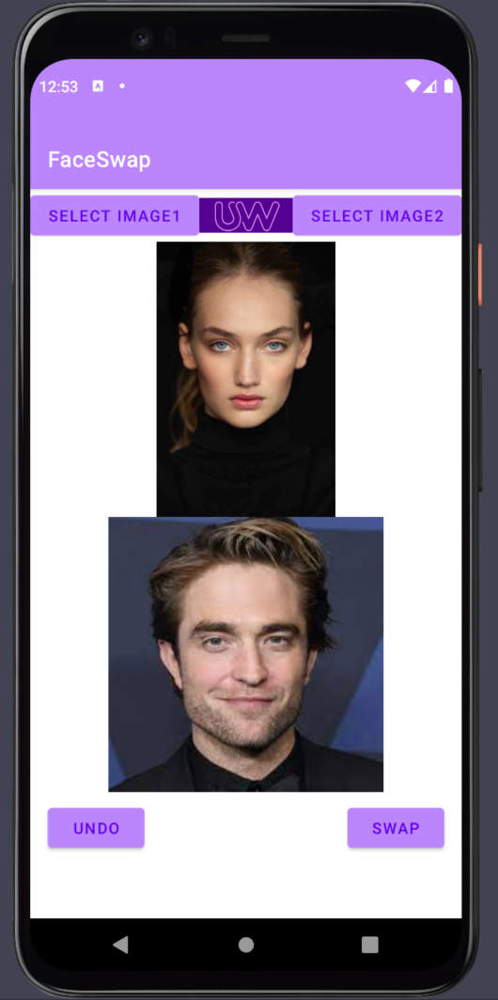
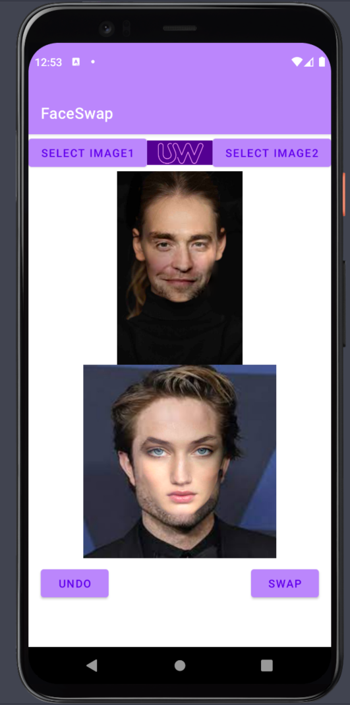
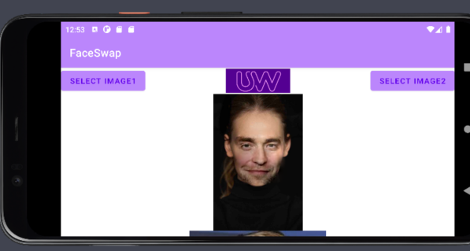

# A3: BlurSwap My Face! 
(Jeremy Cao)

## Overview

I built a swap face application that user can swap human faces from two different photos.

## Using the app 

User can click the "select image1" button and "select image2" button to choose two photos from local gallery
and then the face detect engine will start to detect the human faces from two selected photos.
Once the face dectection action finished, the "swap" will be activated(turning color from grey to purple.）
Then user can click the "swap" button to excecute the swap face feature.
User can also click the "undo" button to undo the face swap action.

## Walkthrough

Or use html to resize it: 

## Reflection/Summary

Summary of why you chose this project, what you learned or found surprising, what you found challenging or unexpected. You might include something you didn't finish or polish or would like to do different in the future. 

